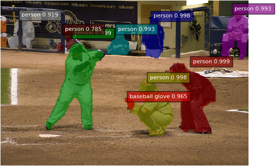
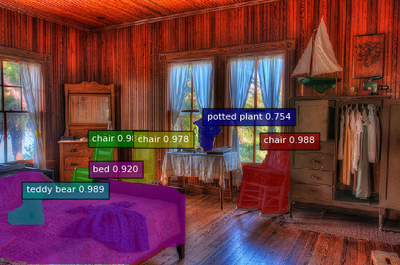
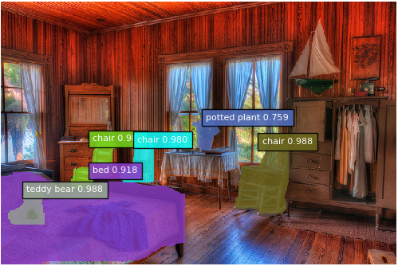

chainer-fcis - FCIS
===================




This is [Chainer](https://github.com/chainer/chainer) implementation of [Fully Convolutional Instance-aware Semantic Segmentation](https://arxiv.org/abs/1611.07709).

Original Mxnet repository is [msracver/FCIS](https://github.com/msracver/FCIS).

Requirement
-----------

- [CuPy](https://github.com/cupy/cupy)
- [Chainer](https://github.com/chainer/chainer)
- [ChainerCV](https://github.com/chainer/chainercv)
- OpenCV2

Additional Requirement
----------------------
- For COCO Dataset class
  - [Cython](http://cython.org/)
  - [pycocotools](https://github.com/cocodataset/cocoapi)
  
- For COCO Training
  - [OpenMPI](https://www.open-mpi.org/)
  - [nccl](https://developer.nvidia.com/nccl)
  - [ChainerMN](https://github.com/chainer/chainermn)

Notification
------------
- Only GPU implementation, No CPU implementation yet.

TODO
----
- VOC
  - [x] Reproduce original repo training accuracy
  - [ ] Refine evaluation code
- COCO
  - [ ] Reproduce original repo training accuracy
  - [ ] Refine evaluation code

Installation
------------

```bash
# Requirement installation
# I recommend to use anacoda.
conda create -n fcis python=2.7
conda install -c menpo opencv
pip install cupy

# Installation
git clone https://github.com/knorth55/chainer-fcis.git
cd chainer-fcis
pip install -e .
```

Inference
---------
```bash
cd examples/coco/
python demo.py
```

Above is our implementation output, and below is original.




Training
--------

```bash
cd examples/voc/
python train.py
```

LICENSE
-------
[MIT LICENSE](LICENSE)


Powered by [DL HACKS](http://deeplearning.jp/hacks/)
