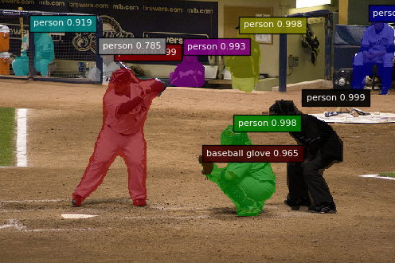

chainer-fcis - FCIS 
===================


This is [Chainer](https://github.com/chainer/chainer) implementation of [Fully Convolutional Instance-aware Semantic Segmentation](https://arxiv.org/abs/1611.07709).

Original repository is [msracver/FCIS](https://github.com/msracver/FCIS).

Requirement
-----------

- Chainer
- ChainerCV
- NumPy
- OpenCV2

Installation
------------

# Attention

Only GPU implementation, No CPU implementation yet.


```bash
git clone https://github.com/knorth55/chainer-fcis.git 
cd chainer-fcis
pip install -e .
```

Inference
---------

Pretrained models can be dowloaded [here](https://drive.google.com/open?id=0B5DV6gwLHtyJZTR0NFllNGlwS3M).

Inference can be done as below;

```bash
cd examples/coco/
mkdir models/
# Download pretrained model in models/
python demo.py
```

Above is our implementation output, and below is original.


Training
--------

I'm going to implement it soon.

LICENSE
-------
[MIT LICENSE](LICENSE)


Powered by [DL HACKS](http://deeplearning.jp/hacks/)
