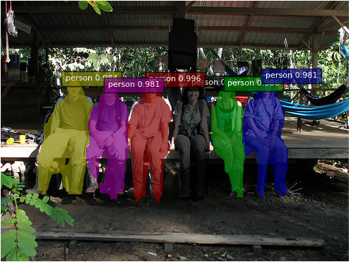

# Pascal VOC & SBD instance segmentation



## Inference

Trained model can be dowloaded [here](https://drive.google.com/open?id=1QDquG8SlbvnlsJpfMhuZn8g0tpe84lVt).

This model is converted from one trained by original repo.

```bash
python demo.py
```

## Training

```bash
# Download dataset manually in ~/data/datasets/VOC
# or run below.
# python download_datasets.py --sbd

python train.py
```

## Evaluation

```bash
# Download dataset manually in ~/data/datasets/VOC
# or run below.
# python download_datasets.py --sbd

python evaluate.py
```

### FCIS ResNet101

This is evaluation of model trained by our repo.

| Implementation | Sampling Strategy | mAP@0.5 | mAP@0.7 |
|:--------------:|:-----------------:|:-------:|:-------:|
| [Original](https://github.com/msracver/FCIS) | Random | 0.646 | 0.499 |
| Ours | Random | 0.630 | 0.488 |

**mAP@0.5**

| Implementation | aeroplane | bicycle | bird | boat | bottle | bus | car | cat | chair | cow | dining table | dog | horse | motorbike | person | potted plant | sheep | sofa | train | tv/monitor |
|:--------------:|:---------:|:-------:|:----:|:----:|:------:|:---:|:---:|:---:|:-----:|:---:|:------------:|:---:|:-----:|:---------:|:------:|:------------:|:-----:|:----:|:-----:|:----------:|
| [Original](https://github.com/msracver/FCIS) | 0.783 | 0.684 | 0.698 | 0.486 | 0.444 | 0.790 | 0.677 | 0.840 | 0.420 | 0.657 | 0.384 | 0.812 | 0.720 | 0.738 | 0.754 | 0.415 | 0.704 | 0.491 | 0.775 | 0.639 |
| Ours | 0.771 | 0.698 | 0.686 | 0.459 | 0.416 | 0.784 | 0.667 | 0.836 | 0.398 | 0.631 | 0.331 | 0.809 | 0.708 | 0.719 | 0.704 | 0.407 | 0.651 | 0.491 | 0.781 | 0.642 |

**mAP@0.7**

| Implementation | aeroplane | bicycle | bird | boat | bottle | bus | car | cat | chair | cow | dining table | dog | horse | motorbike | person | potted plant | sheep | sofa | train | tv/monitor |
|:--------------:|:---------:|:-------:|:----:|:----:|:------:|:---:|:---:|:---:|:-----:|:---:|:------------:|:---:|:-----:|:---------:|:------:|:------------:|:-----:|:----:|:-----:|:----------:|
| [Original](https://github.com/msracver/FCIS) | 0.649 | 0.455 | 0.570 | 0.338 | 0.333 | 0.754 | 0.547 | 0.745 | 0.246 | 0.534 | 0.245 | 0.703 | 0.478 | 0.530 | 0.543 | 0.264 | 0.533 | 0.324 | 0.660 | 0.536 |
| Ours | 0.642 | 0.446 | 0.588 | 0.346 | 0.305 | 0.721 | 0.518 | 0.748 | 0.231 | 0.479 | 0.179 | 0.710 | 0.517 | 0.546 | 0.473 | 0.242 | 0.498 | 0.368 | 0.649 | 0.553 |

## Dataset Download

- [Pascal VOC](http://host.robots.ox.ac.uk/pascal/VOC/)
- [SBD](http://home.bharathh.info/pubs/codes/SBD/download.html)

```bash
# Dataset will be downloaded to ~/data/datasets/VOC
python download_datasets.py --voc
python download_datasets.py --sbd
```
